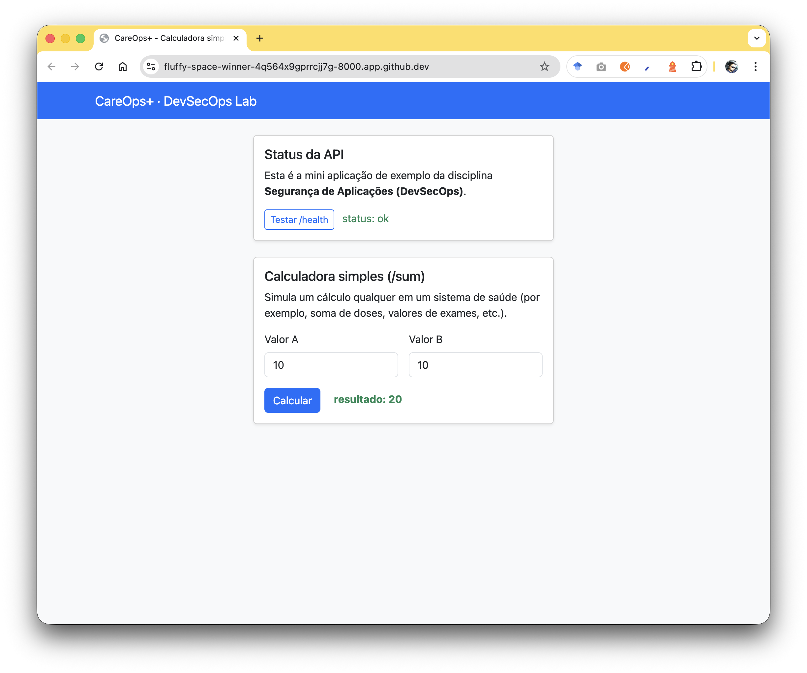

# 🔐 DevSecOps – Projeto da Disciplina  
Repositório oficial da disciplina **Segurança de Aplicações (DevSecOps)** – Dell Academy 2025 – IMD/UFRN.

Este repositório contém:

- Uma aplicação simples em **Flask (Python)**  
- Testes automatizados com **pytest**  
- Dockerfile seguro  
- Pipelines GitHub Actions para cada aula (5–9)  
- Pipeline DevSecOps final integrando todas as ferramentas vistas na disciplina

---

# 🎯 Objetivos do Repositório
Este repositório serve como base prática para:

- Entender como funciona o ciclo DevSecOps moderno  
- Integrar segurança no CI/CD  
- Trabalhar com SAST, SCA, DAST, Container Security e Supply Chain  
- Criar e interpretar SBOM  
- Assinar e verificar imagens  
- Construir um pipeline completo, profissional e reprodutível  

---

# 📂 Estrutura do Projeto

```bash
careops/
│
├── __init__.py
├── database.py
├── main.py                # Mini aplicação 
├── models.py
├── requirements.txt       # Dependências
└── readme.md
```

# Para rodar o aplicação utilize:

No diretório careops:
    pip instalxl -r requirements.txt

No diretório aula1:
uvicorn careops:app --host 0.0.0.0 --port 8000

# Para testar a aplicação 

Acesse a aplicação
	

# Para testar a API 

	•	GET /
	•	GET /health
	