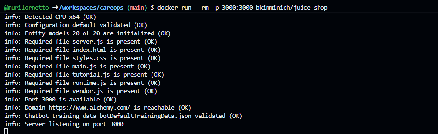

# Lab 1 – OWASP Juice Shop

Disciplina: Segurança de Aplicações (DevSecOps)  
Professor: Walter Lopes  
Aluno: Murilo Russo Netto 
Data: (27/11/2025)

---

## 1. Objetivo do Lab

- Explorar uma aplicação propositalmente vulnerável (OWASP Juice Shop).
- Identificar vulnerabilidades relacionadas ao OWASP Top 10 (2025).
- Registrar, para cada vulnerabilidade encontrada:
  - como foi explorada,
  - qual o impacto,
  - qual categoria OWASP,
  - e sugestões iniciais de mitigação.
- Transferir o aprendizado para o sistema CareOps+.

---

## 2. Ambiente Utilizado

- Instância do OWASP Juice Shop:
  - URL: (https://fantastic-rotary-phone-5gr9994qx5pc754r-3000.app.github.dev/#/)
- Navegador utilizado:
  - Opera Gx
- Ferramentas auxiliares (se usar):
  -  DevTools 
Confirmação do container rodando:
  -
---

## 3. Vulnerabilidades Encontradas

Preencha uma subseção para cada vulnerabilidade.

### 3.1 Vulnerabilidade #1

- Endpoint / funcionalidade:
(https://fantastic-rotary-phone-5gr9994qx5pc754r-3000.app.github.dev/#/contact) / Customer Feedback
- Como foi descoberta: Através do devtools
- Categoria OWASP: A01 BROKEN ACCESS CONTROL
- passo a passo: Após entrar na pagina de feedback, acessar o devtools, procurar pelo campo userIf no codigo da pagina, retirar a propriedade hiden que ele possue e digitar o valor 1 no novo campo que aparece no formulario. Então enviar o feedback.
- Impacto (para o negócio / usuários): Perda de vendas e de reputação / perda de confiança dos usuarios.
- Possíveis mitigações: excluir campos que não devem ser utilizados e não apenas esconde-los.

### 3.2 Vulnerabilidade #2

- Endpoint / funcionalidade: https://fantastic-rotary-phone-5gr9994qx5pc754r-3000.app.github.dev/#/search / Busca
- Como foi descoberta: utilizando codigo javascript na barra de tarefas
- Categoria OWASP: A03 Injection Cross-Site Scripting (XSS)
- Payload / passo a passo:após escrever o seguinte codigo javascript <iframe src="javascript:alert('xss')"> dentro da barra de tarefas o memso executou abrindo uma janela de alerta no navegador.
- Impacto: possibilidade de execução de código malicioso na página, roubo de sessão, captura de teclado,ações em nome do usuário.
- Possíveis mitigações: sanitizar a entrada dos campos de formulario para não permitir a execução de código.

### 3.3 Vulnerabilidade #3

- Endpoint / funcionalidade: https://fantastic-rotary-phone-5gr9994qx5pc754r-3000.app.github.dev/#/rest/user 
- Como foi descoberta: DevTools
- Categoria OWASP: A02 Sensitive Data Exposure
- Payload / passo a passo: adicionar o caminho /rest/user na url do site e depois abrir DevTools → Network → Preview para capturar dados sensiveis. 
- Impacto: viola LGPD/HIPAA/GPDR,exposição de dados
- Possíveis mitigações:Controle de Acesso por Função (RBAC) e filtragem dos dados que são enviados para o frontend através de dtos de resposta por exemplo.

### 3.4 Vulnerabilidade #4

- Endpoint / funcionalidade:https://fantastic-rotary-phone-5gr9994qx5pc754r-3000.app.github.dev/ftp 
- Como foi descoberta: adicionando /ftp na url da pagina
- Categoria OWASP: A05 Security Misconfiguration
- Payload / passo a passo: adicionar /ftp na url da pagina e navegar atraves da estrutura de pastas do servidor,
- Impacto:acesso a dados confidenciais, superficie de ataque aumentada. 
- Possíveis mitigações: Desabilitar a Listagem de Diretórios,Restringir o Acesso a Arquivos Sensíveis,manter arquivos sensiveis fora do diretorio raiz do servidor web.

---

## 4. Conexão com o CareOps+

Escolha **pelo menos 2 vulnerabilidades** encontradas no Juice Shop e responda:

### 4.1 Vulnerabilidade A (referência à seção 3.x)

- Vulnerabilidade no Juice Shop:
- Vulnerabilidade semelhante que poderia existir na CareOps+:
- Endpoint da CareOps+ que poderia ter problema parecido:
- Ideia de como mitigar isso na CareOps+:

### 4.2 Vulnerabilidade B

(Mesma estrutura.)

---

## 5. Reflexão Final

Responda em poucas linhas:

- O que mais te surpreendeu ao explorar o Juice Shop?
- Alguma vulnerabilidade parece “boba” de evitar, mas aparece em muitos sistemas reais?
- Que práticas do SDLC seguro (NIST SSDF / OWASP SAMM) ajudariam a evitar esses problemas?
